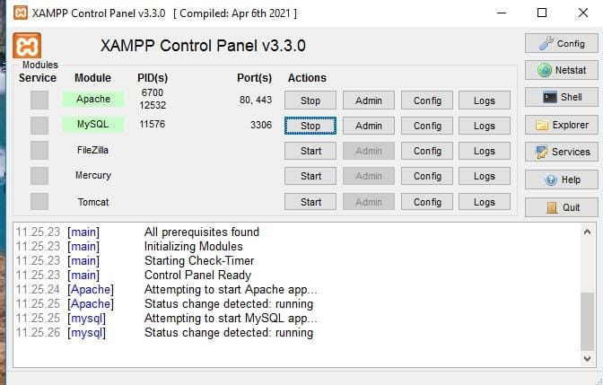
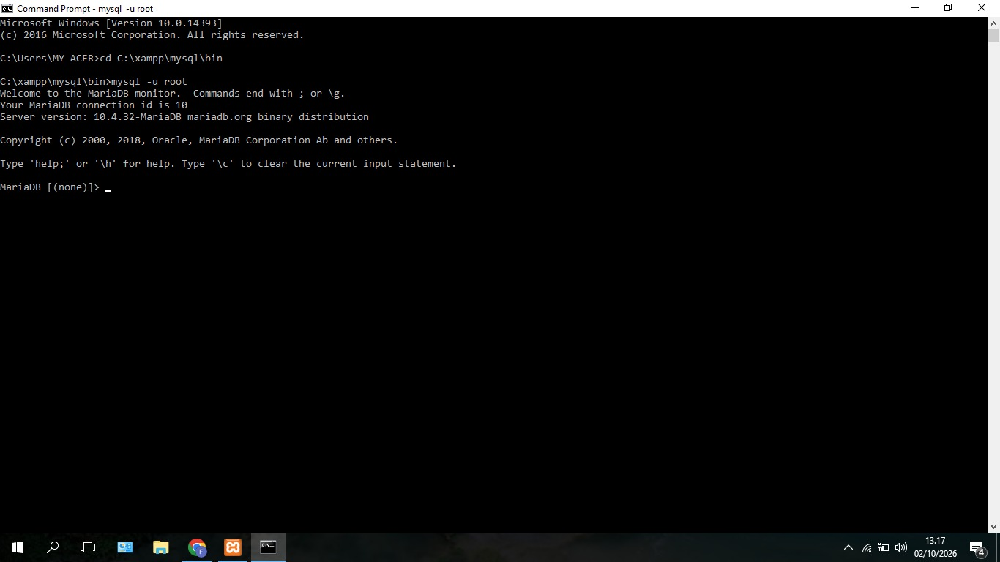
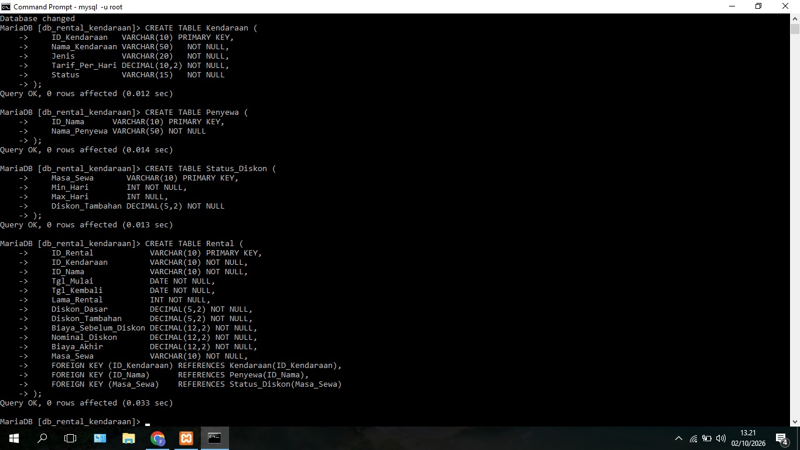
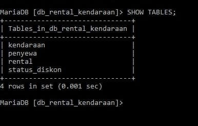
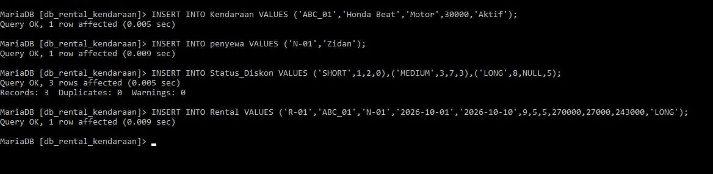
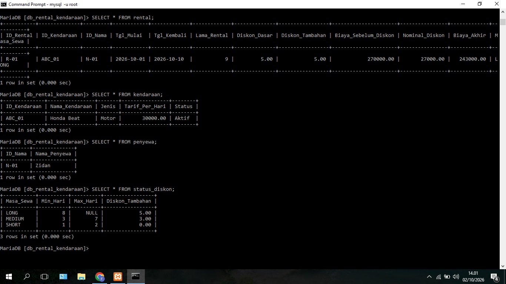

# Database Rental Kendaraan

Database rental kendaraan menggunakan MariaDB (XAMPP) lewat CMD.

## Struktur Tabel

**Kendaraan**

| Kolom | Tipe Data | Keterangan |
|---|---|---|
| ID_Kendaraan | VARCHAR(10) | PK |
| Nama_Kendaraan | VARCHAR(50) | |
| Jenis | VARCHAR(20) | |
| Tarif_Per_Hari | DECIMAL(10,2) | |
| Status | VARCHAR(15) | |

**Penyewa**

| Kolom | Tipe Data | Keterangan |
|---|---|---|
| ID_Nama | VARCHAR(10) | PK |
| Nama_Penyewa | VARCHAR(50) | |

**Status_Diskon**

| Kolom | Tipe Data | Keterangan |
|---|---|---|
| Masa_Sewa | VARCHAR(10) | PK |
| Min_Hari | INT | |
| Max_Hari | INT | boleh NULL |
| Diskon_Tambahan | DECIMAL(5,2) | |

**Rental**

| Kolom | Tipe Data | Keterangan |
|---|---|---|
| ID_Rental | VARCHAR(10) | PK |
| ID_Kendaraan | VARCHAR(10) | FK ke Kendaraan |
| ID_Nama | VARCHAR(10) | FK ke Penyewa |
| Tgl_Mulai | DATE | |
| Tgl_Kembali | DATE | |
| Lama_Rental | INT | |
| Diskon_Dasar | DECIMAL(5,2) | |
| Diskon_Tambahan | DECIMAL(5,2) | |
| Biaya_Sebelum_Diskon | DECIMAL(12,2) | |
| Nominal_Diskon | DECIMAL(12,2) | |
| Biaya_Akhir | DECIMAL(12,2) | |
| Masa_Sewa | VARCHAR(10) | FK ke Status_Diskon |

## Langkah Pembuatan dan Dokumentasi

### 1. Jalankan MySQL di XAMPP

Klik **Start** pada modul MySQL di XAMPP Control Panel.



### 2. Masuk ke MySQL lewat CMD

```
cd C:\xampp\mysql\bin
mysql -u root
```



### 3. Buat database

```sql
CREATE DATABASE db_rental_kendaraan CHARACTER SET utf8mb4;
```


### 4. Pilih database

```sql
USE db_rental_kendaraan;
```


### 5. Buat tabel 

```sql
CREATE TABLE Kendaraan (
    ID_Kendaraan   VARCHAR(10) PRIMARY KEY,
    Nama_Kendaraan VARCHAR(50)   NOT NULL,
    Jenis          VARCHAR(20)   NOT NULL,
    Tarif_Per_Hari DECIMAL(10,2) NOT NULL,
    Status         VARCHAR(15)   NOT NULL
);

CREATE TABLE Penyewa (
    ID_Nama      VARCHAR(10) PRIMARY KEY,
    Nama_Penyewa VARCHAR(50) NOT NULL
);

CREATE TABLE Status_Diskon (
    Masa_Sewa       VARCHAR(10) PRIMARY KEY,
    Min_Hari        INT NOT NULL,
    Max_Hari        INT NULL,
    Diskon_Tambahan DECIMAL(5,2) NOT NULL
);

CREATE TABLE Rental (
    ID_Rental            VARCHAR(10) PRIMARY KEY,
    ID_Kendaraan         VARCHAR(10) NOT NULL,
    ID_Nama              VARCHAR(10) NOT NULL,
    Tgl_Mulai            DATE NOT NULL,
    Tgl_Kembali          DATE NOT NULL,
    Lama_Rental          INT NOT NULL,
    Diskon_Dasar         DECIMAL(5,2) NOT NULL,
    Diskon_Tambahan      DECIMAL(5,2) NOT NULL,
    Biaya_Sebelum_Diskon DECIMAL(12,2) NOT NULL,
    Nominal_Diskon       DECIMAL(12,2) NOT NULL,
    Biaya_Akhir          DECIMAL(12,2) NOT NULL,
    Masa_Sewa            VARCHAR(10) NOT NULL,
    FOREIGN KEY (ID_Kendaraan) REFERENCES Kendaraan(ID_Kendaraan),
    FOREIGN KEY (ID_Nama)      REFERENCES Penyewa(ID_Nama),
    FOREIGN KEY (Masa_Sewa)    REFERENCES Status_Diskon(Masa_Sewa)
);
```



### 6. Cek tabel

```sql
SHOW TABLES;
```



### 7. Isi data contoh

```sql
INSERT INTO Kendaraan VALUES ('ABC_01','Honda Beat','Motor',30000,'Aktif');
INSERT INTO Penyewa VALUES ('N-01','Zidan');
INSERT INTO Status_Diskon VALUES ('SHORT',1,2,0),('MEDIUM',3,7,3),('LONG',8,NULL,5);
INSERT INTO Rental VALUES ('R-01','ABC_01','N-01','2026-10-01','2026-10-10',9,5,5,270000,27000,243000,'LONG');
```



### 8. Lihat isi tabel

```sql
SELECT * FROM rental;
SELECT * FROM kendaraan;
SELECT * FROM penyewa;
SELECT * FROM status_diskon;
```

